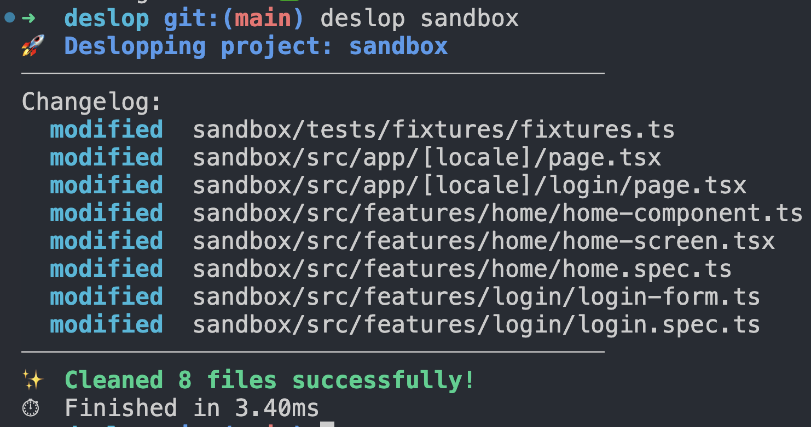

# Deslop

> [!WARNING]
> The project is under heavy development and unstable. Use at your own risk!
> It's recommended to use with git so you can revert any undesired changes.

Clean TypeScript slop **automatically** in milliseconds.



**Currently supports:**
- Replacing relative imports with absolute alias (e.g. `@`) ones. ✅
- Removing AI comments like (`// 1. Do x, y, z; // Step 2`, etc) 🚧


## Installation

The easiest way to install Deslop on macOS or Linux is via Homebrew.

> [!NOTE]
> Currently only works on **MacOS ARM**. 
> For Linux it's not tested but you can attempt manual installation from source.

```bash
brew tap ivy-apps/tap
brew install deslop
deslop --help
```

> [!IMPORTANT]
> Because Deslop uses Gemini to add missing next-intl translation strings, a Gemini API key is currently required to use the tool. An invalid key works, too! Just the translations feature won't work.
> Add `~/.deslop/secrets.json`:

**~/.deslop/secrets.json**
```json
{
  "geminiApiKey": "invalid or a real one to enable next-intl translations"
}
```

**To update**
```bash
brew update
brew upgrade deslop
```

## Develop with Nix

```shell
make install_nix
nix develop
```

## NVIM setup
```shell
brew install --cask iterm2
brew install --cask font-jetbrains-mono-nerd-font
```
**iTerm2 Settings:**
1. Open iTerm
2. Settings > Profiles > Text.
3. Check "Use a different font for non-ASCII text".
4. Select the `JetBrainsMono Nerd Font`.

## GitHub Actions Secrets

- `NPM_TOKEN`: The NPM_TOKEN for releasing Deslop in NPM

## Devevelop Manually

1. Install [GHCUP](https://www.haskell.org/ghcup/)
2. Install GHC, Cabal and HLS.
```bash
ghcup install ghc 9.6.7
ghcup set ghc 9.6.7
ghcup install cabal recommended
ghcup set cabal recommended
ghcup install hls recommended
ghcup set hls recommended
```
3. Install hgold for Golden tests
```bash
cabal install hspec-golden
hgold # to update golden tests
```
